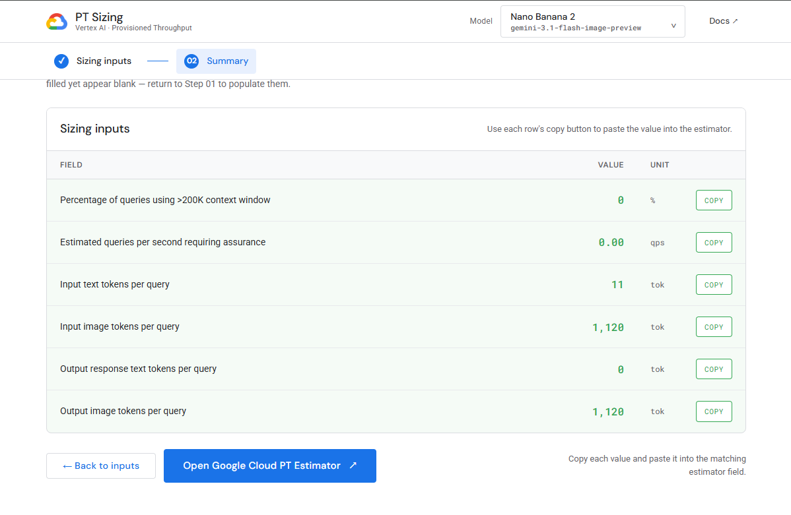

# pt-sizing-calculator



A guided UI that produces the inputs Google's
[Vertex Provisioned Throughput estimator](https://console.cloud.google.com/vertex-ai/provisioned-throughput/price-estimate)
needs for **Nano Banana 2** (`gemini-3.1-flash-image-preview`).

## How it works

1. **Step 01 · Sizing inputs** — six fields total. A1/A2 come from a single
   Cloud Monitoring query; A3–A6 come from `countTokens` on a representative
   sample. You don't have to fill every field — leave anything you don't have
   blank and just copy what you do have.
2. **Step 02 · Summary** — copy each value with its row button, then click
   **Open Google Cloud PT Estimator** and paste each number into the matching
   field. The estimator does the burndown × QPS math on its end; this app
   only collects raw counts.


## Requirements

- Python ≥ 3.9, Node.js ≥ 18, gcloud CLI
- ADC identity with:
  - `roles/monitoring.viewer` on each project you'll query for A1/A2
  - `roles/aiplatform.user` on the project that runs Vertex calls

## Getting started

```bash
# 1. Install deps
pip install -r backend/requirements.txt
cd frontend && npm install && cd ..

# 2. Auth (skip on Workbench / GCE with attached SA)
gcloud auth application-default login
gcloud config set project <your-project>

# 3. Run
python server.py
```

`server.py` starts the API on `:8000`, the UI on `:5173`, and prints the URLs
to open. Ctrl-C stops both.

> If you're hitting the dev server from your laptop and port 5173 is blocked,
> open a firewall rule:
> ```
> gcloud compute firewall-rules create pt-sizing-dev \
>   --rules=tcp:5173 --source-ranges="$(curl -s ifconfig.me)/32"
> ```

## Optional: provision GCP scaffolding with Terraform

Skip the console click-ops — `terraform/` enables the APIs, creates a
dedicated service account, and grants the IAM roles. The app still runs
locally; Terraform just sets up GCP.

```bash
cd terraform
cp terraform.tfvars.example terraform.tfvars   # set host_project_id
terraform init && terraform apply
```

See [terraform/README.md](terraform/README.md) for details.

# Future Work

Add more models
